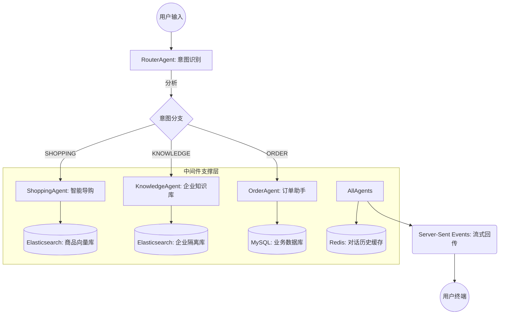

# 核心功能与中间件集成架构总结

本项目是一个集成了向量检索、长短期记忆、意图路由及多模态生成的企业级 AI 应用。通过 Spring AI 框架，我们将底层 LLM 与企业中间件进行了深度协同。

## 1. 核心架构流转图



## 2. 核心功能及实现深度

| 功能模块 | 核心技术 | 业务价值与实现细节 |
| :--- | :--- | :--- |
| **智能意图路由** | XML Steering + CoT | 基于 `RouterAgent` 进行 `<thinking>` 推理，确保多分类场景下的极低误判率。 |
| **隔离知识库 (RAG)** | Dual VectorStore | 文档解析、分片注入，通过双索引确保企业私域数据与公开数据物理隔离。 |
| **确定性动作执行** | Defensive Prompting | 针对订单逻辑应用防御性指令，防止 Agent 在参数缺失（orderId/name）时产生幻觉。 |
| **对话状态持续** | Redis Memory | 结合 `MessageChatMemoryAdvisor`，实现分布式、可持久化的长轮次对话记忆。 |
| **可观测性增强** | Call Around Advisor | 自研 `InfoLoggerAdvisor` 记录 LLM 原始上下文，为模型调优提供透明数据。 |

## 3. 提示词工程 (Prompt Engineering) 最佳实践

本项目通过借鉴 **Claude (Anthropic)** 的提示工程哲学，确立了统一的指令规范：

- **XML 结构化控制**：所有 System Prompt 均采用 `<role>`, `<rules>`, `<constraints>` 等标签。模型对标签边界的敏感度远高于纯文本，有效防止模型越权或指令遗忘。
- **思维链 (Chain of Thought)**：在复杂决策节点（如路由、参数解析）强制开启 `<thinking>` 暂存区。要求模型在输出最终答案前先进行内部逻辑推演，大幅提升逻辑严密性。
- **去 AI 味调优 (Tone Tuning)**：通过负向指令排除“好的，我知道了”等冗余响应，使 Agent 的语气更贴近真人专家导购。

## 4. 核心中间件集成细节

### 🍃 Elasticsearch (向量索引核心)
*   **双索引架构**：`products` (公开) / `knowledge` (加密)。
*   **检索算法**：基于 Cosine 相似度的 Top-K 向量匹配。

### 🔴 Redis (分布式记忆体)
*   **会话管理**：基于 `sessionId` 的对话列表存储，默认回放 10 轮历史，确保跨节点部署时记忆不丢失。

### 📄 Apache Tika (文档解析泵)
*   **全格式支持**：自动适配 PDF/Word/Excel。
*   **元数据提取**：在文本向量化的同时，保留文件来源、页码等源信息。

---
> [!IMPORTANT]
> **架构安全性**：本项目坚持“环境感知、物理隔离”原则。通过双 Bean 声明实现的 VectorStore 隔离是企业化落地的核心壁垒，从代码层面杜绝了跨库检索风险。


## 5. Harness Engineering (驭缰工程)

本项目引入了 **Harness Engineering** 方法论——将仓库打造为 AI Agent 的"操作系统"，通过编码化约束取代口头约定，让 Agent 在可控的缰绳内高效奔跑。

### 📁 工程目录结构
```
springai/
├── AGENTS.md                    ← Agent 导航地图（~40行，地图而非手册）
├── docs/
│   ├── ARCHITECTURE.md          ← 架构层级与双向量隔离设计
│   └── DEVELOPMENT.md           ← 构建、测试、环境指南
├── scripts/
│   └── validate.sh              ← 统一验证管道 (build → lint-arch → test)
├── harness/
│   ├── tasks/                   ← 任务状态和检查点
│   ├── trace/                   ← 执行轨迹和失败记录
│   └── memory/                  ← 经验教训存储
└── src/test/.../ArchitectureConstraintsTest.java  ← ArchUnit 架构防腐测试
```

### 🔗 三层防护体系
| 层级 | 机制 | 说明 |
| :--- | :--- | :--- |
| **信息层** | `AGENTS.md` + `docs/` | Agent 启动时读取导航地图，按需加载架构文档，不浪费上下文窗口。 |
| **约束层** | `ArchUnit` + `validate.sh` | 将 Layer 0-3 分层规则编码为自动化测试，违规即报错，CI 一票否决。 |
| **状态层** | `harness/` 目录群 | 任务检查点、失败轨迹和经验教训的持久化存储，跨会话传递知识。 |

### 🔄 Agent 工作流闭环
```
Agent 启动 → 读 AGENTS.md → 制定计划 → 人类批准 → 写代码
    ↓                                                   ↓
经验沉淀 ← 完成验证 ← 跑 validate.sh ← 存检查点 ← 预验证架构
(memory/)   (trace/)                    (tasks/)
```

# 更新日志

### 2026-04-04 | Harness Engineering 驭缰工程落地 & 前端优化
- **Harness Engineering 全套基础设施**：引入 `AGENTS.md` 导航地图、`docs/` 架构文档层、`ArchUnit` 机械化约束层以及 `harness/` 状态记忆层，将项目升级为 AI Agent 的"操作系统"。
- **ArchUnit 架构防腐测试**：通过 `ArchitectureConstraintsTest` 强制执行 Layer 0-3 分层规则，违规代码在编译阶段即被拦截。
- **统一验证管道 `validate.sh`**：建立 `build → lint-arch → test` 自动化流水线，确保每次变更通过完整防腐检验。
- **Agent 工作流规范化**：在 `AGENTS.md` 中定义任务登记 → 故障追溯 → 经验沉淀的强制闭环，保障跨会话知识传递。
- **Markdown 渲染鲁棒性增强**：前端引入 `renderContent` 逻辑及正则清洗，自动修正模型输出中常见的 Markdown 格式问题。
- **SSE 流式换行修复**：优化 SSE 数据流处理逻辑，解决流式响应中的段落合并与换行丢失问题。
- **意图分类指令精细化**：重构 `RouterAgent` 提示词，确立了 SHOPPING/ORDER/GENERAL 三大核心意图边界。

### 2026-04-02 | 提示词工程深度优化 (Claude 风格)
- **结构化重构 (XML Tagging)**：将所有 `.st` 模板转换为 XML 结构化格式，极大提升了模型对指令边界的识别能力。
- **引入思维链 (CoT) 推理**：针对 `RouterAgent` 引入 `<thinking>` 标签，强制模型在决策前进行自我分析。
- **Java 解析逻辑适配**：更新 `RouterAgent` 正则提取逻辑，支持从复杂 XML 响应中精准解析意图
- **防御性指令增强**：针对订单查询等关键路径完善参数校验，强化“据实回答”原则，减少幻觉。
- **对话风格调优**：移除机器人式开场白，调整为更像人类专家的导购口吻。

### 2026-03-27 | 企业级知识库与可观测性
- **物理隔离知识库**：实现导购库与企业内部知识库的双 VectorStore 隔离架构。
- **文档自动化向量化**：支持企业文档批量预处理、解析并索引入 Elasticsearch。
- **全链路日志增强**：引入 `InfoLoggerAdvisor` 捕捉 LLM 完整请求响应，提升系统透明度。

### 2026-03-25 | 意图分析与多模态扩展
- **商品特征深度提取**：通过 `ProductAnalyzerAgent` 实现自然语言到结构化 JSON 的精准转换。
- **多模态能力接入**：增加设计图/商品效果图生成功能，丰富导购交互形式。

### 2026-03-15 | 文档与规范建设
- 完善项目架构说明及 README 文档，明确技术选型。

### 2026-03-11 | 项目初始化
- 完成 Spring AI 框架集成与基础路由 Agent 搭建。