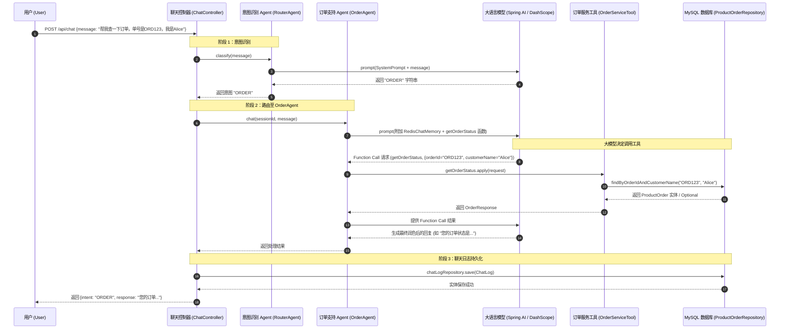

### 1. 基础对话接口 (Chat)
这个接口负责接收用户的聊天信息，进行意图识别（Router Agent），并路由到负责特定功能的 Agent 身上，同时会记录历史会话。

- **URL:** `POST http://localhost:8080/api/chat`
- **Content-Type:** `application/json`

**请求体 (JSON):**
```json
{
  "sessionId": "user-123",
  "message": "我想买一双适合户外跑步的阿迪达斯运动鞋"
}
```
*(注：`sessionId` 是可选的，如果不传默认会使用 "default-session"。为了让机器记住你的上下文对话，一般需要每次传入相同的 sessionId)*

**`curl` 示例:**
```bash
curl -X POST http://localhost:8080/api/chat \
     -H "Content-Type: application/json" \
     -d '{"sessionId":"user-123", "message":"我想买一双适合户外跑步的运动鞋"}'
```

---

### 2. 偏好分析接口 (Analyze Preference)
利用 AI 结构化输出分析用户输入的一段文字，并提取出对应的产品偏好信息（转化为对应的 `ProductPreference` 对象）。

- **URL:** `POST http://localhost:8080/api/chat/analyze-preference`
- **Content-Type:** `application/json`

**请求体 (JSON):**
```json
{
  "description": "我平时喜欢穿黑色的衣服，不喜欢带太多图案的，预算大概在500元以内，主要是日常通勤穿。"
}
```

**`curl` 示例:**
```bash
curl -X POST http://localhost:8080/api/chat/analyze-preference \
     -H "Content-Type: application/json" \
     -d '{"description":"我平时喜欢穿黑色的衣服，不喜欢带太多图案的，预算大概在500元以内，主要是日常通勤穿。"}'
```

---

### 3. 生成商品设计图接口 (Generate Design)
利用 Image Model（例如通义万相、OpenAI Dall-E 等）根据文本描述生成一张设计或展示用的图片。

- **URL:** `POST http://localhost:8080/api/chat/design`
- **Content-Type:** `application/json`

**请求体 (JSON):**
```json
{
  "description": "一款赛博朋克风格的未来蓝牙耳机，带有霓虹发光线条"
}
```

**`curl` 示例:**
```bash
curl -X POST http://localhost:8080/api/chat/design \
     -H "Content-Type: application/json" \
     -d '{"description":"一款赛博朋克风格的未来蓝牙耳机，带有霓虹发光线条"}'
```

# 最长调用链 (Longest Call Chain)

当用户查询订单状态时，会触发整个系统中最长的完整调用链（包含两次大模型调用、一次数据库查询、一次日志保存）。




