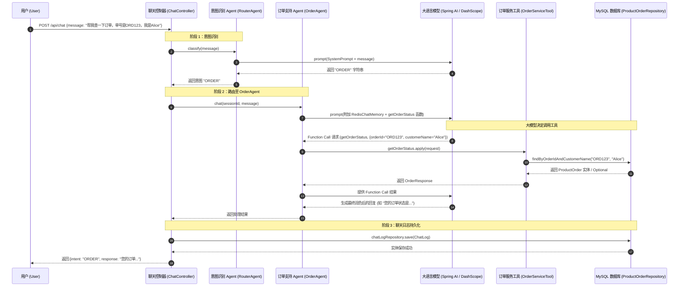

# 最长调用链 (Longest Call Chain)

当用户查询订单状态时，会触发整个系统中最长的完整调用链（包含两次大模型调用、一次数据库查询、一次日志保存）。

```mermaid
sequenceDiagram
    autonumber
    participant User as 用户 (User)
    participant ChatController as 聊天控制器 (ChatController)
    participant RouterAgent as 意图识别 Agent (RouterAgent)
    participant OrderAgent as 订单支持 Agent (OrderAgent)
    participant LLM as 大语言模型 (Spring AI / DashScope)
    participant OrderServiceTool as 订单服务工具 (OrderServiceTool)
    participant DB as MySQL 数据库 (ProductOrderRepository)

    User->>ChatController: POST /api/chat {message: "帮我查一下订单，单号是ORD123，我是Alice"}
    
    %% Phase 1: Intent Classification
    Note over ChatController,RouterAgent: 阶段 1：意图识别
    ChatController->>RouterAgent: classify(message)
    RouterAgent->>LLM: prompt(SystemPrompt + message)
    LLM-->>RouterAgent: 返回 "ORDER" 字符串
    RouterAgent-->>ChatController: 返回意图 "ORDER"

    %% Phase 2: Order Processing with Tool Call
    Note over ChatController,OrderAgent: 阶段 2：路由至 OrderAgent
    ChatController->>OrderAgent: chat(sessionId, message)
    OrderAgent->>LLM: prompt(附加 RedisChatMemory + getOrderStatus 函数)
    
    %% Tool call negotiation
    Note over LLM,DB: 大模型决定调用工具
    LLM-->>OrderAgent: Function Call 请求 (getOrderStatus, {orderId="ORD123", customerName="Alice"})
    OrderAgent->>OrderServiceTool: getOrderStatus.apply(request)
    
    OrderServiceTool->>DB: findByOrderIdAndCustomerName("ORD123", "Alice")
    DB-->>OrderServiceTool: 返回 ProductOrder 实体 / Optional
    OrderServiceTool-->>OrderAgent: 返回 OrderResponse
    
    OrderAgent->>LLM: 提供 Function Call 结果
    LLM-->>OrderAgent: 生成最终润色后的回复 (如 "您的订单状态是...")
    OrderAgent-->>ChatController: 返回处理结果
    
    %% Phase 3: Persist Log
    Note over ChatController,DB: 阶段 3：聊天日志持久化
    ChatController->>DB: chatLogRepository.save(ChatLog)
    DB-->>ChatController: 实体保存成功
    
    ChatController-->>User: 返回 {intent: "ORDER", response: "您的订单..."}
```

